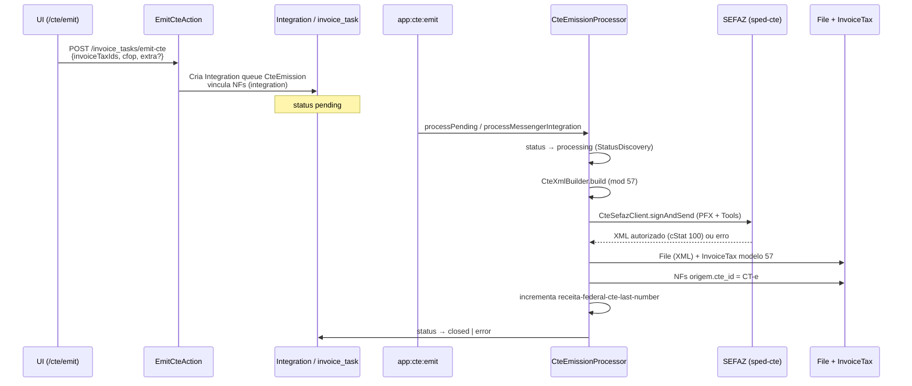

# CT-e — Emissão com NFePHP (sped-cte) e DACTE (sped-da)

Documentação técnica do fluxo de **emissão real de CT-e (modelo 57)** no módulo `api-platform-accounting`.

Implementação principal: issue [#16](https://github.com/ControleOnline/api-platform-accounting/issues/16) (NFePHP + DACTE).  
Correção de validação de quantidade de NFs: issue [#26](https://github.com/ControleOnline/api-platform-accounting/issues/26) (mínimo **1** NF, alinhado à prática fiscal).  
Vínculo imediato NF → task no emit-cte: issue [#27](https://github.com/ControleOnline/api-platform-accounting/issues/27) (`invoice_task_id` / `InvoiceTax::$integration` na criação da task).

## Objetivo

Consumir a fila de emissão de CT-e (`cte_emission` / `invoice_task` tipo `cte_emission`), montar o XML com **NFePHP** (`nfephp-org/sped-cte`), assinar e transmitir à SEFAZ com o **certificado digital da empresa** (configuração fiscal), persistir o XML autorizado, vincular o CT-e às NFs de origem (modelo 55) e disponibilizar o **DACTE em PDF** a partir do XML armazenado (sem reconsulta à SEFAZ só para visualização).

## Escopo e fora de escopo

**Dentro do escopo (esta issue):**

- Worker/comando de consumo da fila
- Montagem do CT-e a partir das NFs vinculadas
- Assinatura e transmissão SEFAZ
- Persistência do XML e vínculo `cte_id`
- Atualização de status via `StatusService::discoveryStatus` (nunca por ID fixo)
- Incremento de `receita-federal-cte-last-number` após autorização
- Geração de PDF (DACTE) no endpoint de download a partir do XML persistido

**Fora de escopo desta issue:**

- Campos da tela de emissão e listagem `without-cte` (trabalho paralelo de UI/staging)
- Alterações de formulário de configuração fiscal (já existentes em `ui-common`)

## Visões de produto (`APP_TYPE`)

| Visão | Papel neste fluxo |
| --- | --- |
| **MANAGER** / **LOGISTIC** | Operador dispara a emissão a partir da tela `/cte/emit?ids=` (UI em `ui-logistic` ou equivalente). Visualiza CT-e emitidos e abre o DACTE. |
| **API (accounting)** | Backend único responsável pela montagem, SEFAZ, persistência e download. |
| **Outras visões (CRM, POS, SHOP, …)** | Não emitem CT-e nem consomem a fila. Podem apenas visualizar documentos fiscais já emitidos se a UI compartilhada permitir. |

O módulo **não** deve assumir regras de tela, seleção de NFs ou layout de listagem — isso permanece na UI. A API só recebe `invoiceTaxIds` + `cfop` (+ `extra` opcional) e processa de forma assíncrona.

UI de **consulta** (não emissão): [CT-e — Detalhe e PDF (DACTE)](https://github.com/ControleOnline/ui-logistic/wiki/CT-e-Detalhe-e-PDF) — lista `/cte` aba CTE, modal PDF e página `/cte/detail` read-only (ui-logistic#34). O endpoint de download continua neste módulo.

## Configuração fiscal da empresa

Lida por `CteFiscalConfig` a partir das configs da empresa emissora (aba Fiscal / Receita Federal):

| Chave | Uso |
| --- | --- |
| `receita-federal-certificate-file` | Arquivo `.pfx`/`.p12` (conteúdo binário ou referência a `File`) |
| `receita-federal-certificate-password` | Senha do certificado |
| `receita-federal-environment` | `1` = produção, `2` = homologação |
| `receita-federal-tax-regime` | Regime tributário (contexto fiscal) |
| `receita-federal-ibge-code` | Código IBGE do município do emitente |
| `receita-federal-cte-enabled` | Flag de habilitação de CT-e |
| `receita-federal-cte-serie` | Série do CT-e |
| `receita-federal-cte-last-number` | Último número autorizado (incrementado **somente após** autorização SEFAZ) |
| `receita-federal-cte-rntrc` (opcional) | RNTRC; se ausente, pode vir de documento da transportadora no payload `extra` |

Sem certificado + senha válidos a emissão falha com mensagem clara e status de erro na tarefa.

## Fluxo operacional

### 1. Enfileiramento

- **Endpoint:** `POST /invoice_tasks/emit-cte` (`EmitCteAction` → `EmitCteService`).
- **Payload:**
  - `invoiceTaxIds` ou `selected`: lista de IDs de `invoice_tax` (modelo 55)
  - `cfop` (obrigatório)
  - `extra` (opcional): `natOp`, `rntrc`, `xMunEnv`, `UFEnv`, etc.
- Cria `Integration` com `queueName`/`taskType` de emissão CT-e e **vincula as NFs imediatamente** (`InvoiceTax::setIntegration($integration)` + `flush`) — ver seção [Vínculo imediato NF → task (#27)](#vínculo-imediato-nf--task-27).
- **Validações de negócio** (`EmitCteService::emit`):
  - **Mínimo 1 NF** (`count($ids) < 1` → 400 com mensagem *"Selecione ao menos uma NF para emitir o CT-e."*). Um CT-e pode referenciar uma única NF-e (caso mais comum na legislação e na prática); agrupar várias NFs do mesmo remetente/destinatário é opcional, não obrigatório. Correção da validação rígida anterior (`< 2`) em [#26](https://github.com/ControleOnline/api-platform-accounting/issues/26).
  - Lista não vazia após normalização (`intval` + unique + filter).
  - CFOP obrigatório (não vazio).
  - Todas as NFs existem no repositório; caso contrário 400.
  - NFs não possuem `cte` nem `integration` em andamento (já ocupadas).
  - Isolamento multi-tenant: `assertTenantCanEmit` (exceto `ROLE_SUPER`).
  - Payload de bind de arrays usa `Doctrine\DBAL\ArrayParameterType::INTEGER` (compatível DBAL 3+/4; evita `Connection::PARAM_INT_ARRAY` removido).

### 2. Consumo da fila

- **Comando:** `php bin/console app:cte:emit [--limit=20]`
- **Messenger / cron** `tenant:integration:start`: `IntegrationService::executeIntegration` resolve o handler pelo `queueName` e chama `CteEmissionService::integrate()`.
- `CteEmissionProcessor`:
  - Processa `Integration` com fila `cte_emission` / `CteEmission` **e** tarefas `invoice_task` tipo `cte_emission` em status pending.
  - Status **somente** via `StatusService::discoveryStatus('processing'|'closed'|'error', …, 'invoice_task'|'integration')`.

#### Caminho Messenger (hotfix app-community#689)

Antes do hotfix, `CteEmissionService::integrate()` era um **stub**: criava `InvoiceTax` model 57 com chave/número fabricados e status **closed**, **sem** XML, **sem** assinatura e **sem** transmissão SEFAZ. A UI (`/cte`) mostrava Closed falso.

**Contrato atual (obrigatório):**

| Artefato | Responsabilidade |
| --- | --- |
| `CteEmissionService` | Thin handler: **apenas** `return $this->processor->processMessengerIntegration($integration)` |
| `CteEmissionProcessor::processMessengerIntegration` | Normaliza body/payload (`invoiceTaxIds`/`selected` + `cfop` + `extra`); exige ids e CFOP; delega a `processTask` |
| `processTask` | processing → build → signAndSend → persistCte (Closed **somente** após XML autorizado) |
| `processIntegrations` | Em sucesso marca Integration closed; em **qualquer** exceção marca **error** (nunca closed silencioso) |

`app:cte:emit` e o caminho messenger compartilham **a mesma** implementação (`CteEmissionProcessor`). Não deve existir segundo caminho que invente Closed.

Referência de produto: [app-community#689](https://github.com/ControleOnline/app-community/issues/689).

### 3. Montagem do XML

- `CteXmlBuilder::build($invoices, $fiscal, $cfop, $extra)`
- Modelo **57**, versão **4.00**, modal rodoviário (`01`).
- Partes: emitente (empresa), remetente, destinatário, tomador, chaves das NFs 55 (`infNFe`), totais, municípios/UF, RNTRC.
- Número/série derivados da config fiscal; chave de acesso gerada conforme regras do layout.

### 4. Assinatura e transmissão

- `CteSefazClient::signAndSend`
- Pacotes: `nfephp-org/sped-cte` (`Certificate::readPfx`, `Tools::signCTe`, `sefazEnviaCTe`, consulta de recibo se `cStat` 103/104).
- Ambiente e UF a partir da config da empresa.
- Sucesso: `cStat` / protocolo **100**; XML com protocolo anexado quando possível.
- Falha: exception com motivo SEFAZ; tarefa marcada como `error` e payload atualizado com mensagem.

### 5. Persistência

- XML autorizado salvo via `FileService` (tipo `invoice_tax`, nome `cte-{chave}.xml`).
- Novo `InvoiceTax` com `invoice_model = 57`, chave, número, totais, vínculos de pessoas/endereços, `integration` da tarefa, status closed.
- Cada NF de origem recebe `cte` (`cte_id`) apontando para o CT-e.
- `receita-federal-cte-last-number` atualizado para o número autorizado.

### 6. Download do DACTE (PDF)

- **Endpoint existente:** `GET /invoice_taxes/{id}/download-nf` (formatos `pdf`, `xml`, `base64`).
- `DownloadNFService::getPdf`:
  - Se `invoice_model === 57` (ou XML detectado como CT-e) → `NFePHP\DA\CTe\Dacte` (`sped-da`).
  - Caso contrário → DANFE (NF-e modelo 55).
- **Não** reconsulta SEFAZ: usa exclusivamente o XML já armazenado em `InvoiceTax` / `File`.
- A tela de CT-es emitidos deve abrir esse endpoint para o PDF do DACTE.

## Componentes principais

| Componente | Responsabilidade |
| --- | --- |
| `EmitCteAction` / `EmitCteService` | API de enfileiramento e validações de negócio |
| `CteEmitCommand` (`app:cte:emit`) | Entrada de cron/worker |
| `CteEmissionProcessor` | Orquestra status, build, SEFAZ, persistência |
| `CteFiscalConfig` | Carrega e atualiza configs fiscais da empresa |
| `CteXmlBuilder` | Monta XML CT-e 4.00 |
| `CteSefazClient` | Assina e transmite com NFePHP |
| `DownloadNFService` | PDF/XML do documento (DACTE ou DANFE) |
| `ListInvoicesWithoutCteAction` / `InvoicesWithoutCteService` | Listagem de NFs elegíveis (paralelo) |

## Dependências de pacote

Presentes no runtime do pai `api-community`:

- `nfephp-org/sped-cte`
- `nfephp-org/sped-da` (DACTE)
- `nfephp-org/sped-common` (Certificate, etc.)

## Vínculo imediato NF → task (#27)

### Problema corrigido

Antes do fix, `POST /invoice_tasks/emit-cte` criava a `Integration` / `invoice_task` com `status: open|pending`, mas **não** preenchia `invoice_tax.invoice_task_id` (mapeado como `InvoiceTax::$integration` → `Integration`). O vínculo só ocorria depois, em:

- `CteEmissionProcessor::persistCte` (`$invoice->setIntegration($task)`)
- `CteEmissionService::integrate` (`$nf->setIntegration($integration)`)

Enquanto a task estava em andamento (`open` / `pending` / `processing`), `GET /invoice_taxes/without-cte` continuava listando as NFs e o operador podia reenviar o mesmo conjunto.

### Contrato atual (`EmitCteService::emit`)

Após `integrationService->addIntegration(...)`:

1. Para **cada** `InvoiceTax` selecionada: `$invoice->setIntegration($integration)` + `persist`.
2. `EntityManager::flush()` **antes** de retornar a Integration (HTTP 201).
3. Resposta da API **não muda** (id, `@id`, status).

Com isso, no mesmo instante do `201`:

- cada NF tem `invoice_task_id` = id da task criada;
- `GET /invoice_taxes/without-cte` **não** retorna mais essas NFs, mesmo com `cte_id` ainda `NULL` e task ainda `open`.

### Filtro de `InvoicesWithoutCteService`

A listagem de NFs elegíveis exclui qualquer NF que já esteja “ocupada”:

| Critério | Origem |
| --- | --- |
| `cte_id IS NULL` | CT-e ainda não emitido / vinculado |
| `invoice_task_id IS NULL` (coluna presente) | SQL path |
| exclusão de IDs com `invoice_task_id IS NOT NULL` (`busyInvoiceIds`) | Doctrine path (`invoiceTax.cte IS NULL` + filtro pós-query) |

Modelos listáveis: **55** e **65** (`NF_MODELS`). Modelo CT-e = **57**.

### Validações que dependem do vínculo

- Tentativa de emitir de novo NFs já com `integration` → `400` *"Uma ou mais NFs já estão em emissão ou emitidas."*
- NF com `cte` já preenchido → `400` *"NF … já possui CT-e vinculado."*
- Isolamento multi-tenant (`assertTenantCanEmit`) permanece inalterado.

### Falha da task (`status: error`)

Em caso de erro posterior (SEFAZ, validação no processor, etc.):

- o vínculo `invoice_task_id` **não** é limpo automaticamente nesta issue (evita reentrada silenciosa na fila `without-cte`);
- reprocesso / cancelamento com liberação do vínculo deve ser tratado em issue separada de retry/cancelamento;
- o processor continua podendo setar `cte` + `integration` no sucesso sem conflito com o vínculo já gravado no emit.

### Componentes envolvidos

| Componente | Papel no vínculo |
| --- | --- |
| `EmitCteService` | Seta `integration` + flush na criação da task |
| `InvoicesWithoutCteService` | Filtra por `cte` null **e** ausência de `invoice_task_id` |
| `ListInvoicesWithoutCteAction` | Endpoint HTTP da listagem |
| `CteEmissionProcessor` / `CteEmissionService` | No sucesso, persistem CT-e e reforçam vínculos; não dependem de limpar o bind do emit |

### Testes

- `tests/Service/EmitCteServiceTest.php` — assert de bind imediato das NFs na Integration criada.
- `tests/Service/InvoicesWithoutCteServiceTest.php` — exclusão de NFs com `invoice_task_id` preenchido.

## Status e erros

- Transições de `invoice_task` / integração: **pending → processing → closed | error**.
- Sempre via `StatusDiscovery` (real status + context), nunca IDs hard-coded.
- Em erro: mensagem SEFAZ ou de validação gravada no payload/body da tarefa; NFs podem permanecer vinculadas à integração para auditoria (comportamento de reprocesso depende de operação).

## Testes automatizados

Em `tests/Service/Cte/`:

- `CteXmlBuilderTest`
- `CteFiscalConfigTest`
- `CteEmissionProcessorTest`

Em `tests/Service/`:

- `EmitCteServiceTest` — validações de emit + **bind imediato** `setIntegration` (#27)
- `InvoicesWithoutCteServiceTest` — exclusão de NFs com `invoice_task_id` / `cte` preenchidos

Cobrem montagem, carga de config, fluxo do processor (com mocks de SEFAZ/persistência) e o contrato de fila `without-cte`.

## Links relacionados

| Destino | URL |
| --- | --- |
| Issue (NFePHP + DACTE) | https://github.com/ControleOnline/api-platform-accounting/issues/16 |
| Issue (mínimo 1 NF no emit-cte) | https://github.com/ControleOnline/api-platform-accounting/issues/26 |
| Issue (vínculo imediato invoice_task_id no emit) | https://github.com/ControleOnline/api-platform-accounting/issues/27 |
| Issue (worker stub Closed falso) | https://github.com/ControleOnline/app-community/issues/689 |
| Home do módulo | https://github.com/ControleOnline/api-platform-accounting/wiki |
| Wiki API (pai) | https://github.com/ControleOnline/api-community/wiki |
| Wiki App | https://github.com/ControleOnline/app-community/wiki |
| Config fiscal (UI) | Módulo `ui-common` — aba Fiscal / Receita Federal da empresa |
| Download NF/CT-e | `GET /invoice_taxes/{id}/download-nf` |

## Manutenção

- Novos campos de layout CT-e: preferir extensão em `CteXmlBuilder` e testes unitários; evitar crescer o processor.
- Mudança de versão de schema SEFAZ: alinhar `schemes` / `versao` em `CteSefazClient` e validar em homologação (`tpAmb=2`).
- Certificado: nunca logar senha ou conteúdo binário do PFX; apenas existência/ausência.

## Listagem CT-e (status e cor)

A coleção `GET /invoice_taxes?invoiceModel=57` usa normalização `invoice_tax:read`. O `Status` embutido só serializa `id`/`status`/`realStatus`/`color` se esses campos declararem o grupo `invoice_tax:read` na entidade compartilhada `Status` (`api-platform-common`).

Documentação canônica: [Status — grupos de serialização para recursos aninhados](https://github.com/ControleOnline/api-platform-common/wiki/Status-Serialization-Groups) (fix #32).
