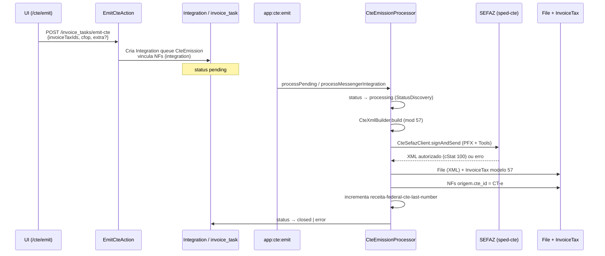

# CT-e — Emissão com NFePHP (sped-cte) e DACTE (sped-da)

Documentação técnica do fluxo de **emissão real de CT-e (modelo 57)** no módulo `api-platform-accounting`, implementado na issue [#16](https://github.com/ControleOnline/api-platform-accounting/issues/16).

## Objetivo

Consumir a fila de emissão de CT-e (`cte_emission` / `invoice_task` tipo `cte_emission`), montar o XML com **NFePHP** (`nfephp-org/sped-cte`), assinar e transmitir à SEFAZ com o **certificado digital da empresa** (configuração fiscal), persistir o XML autorizado, vincular o CT-e às NFs de origem (modelo 55) e disponibilizar o **DACTE em PDF** a partir do XML armazenado (sem reconsulta à SEFAZ só para visualização).

## Escopo e fora de escopo

**Dentro do escopo (esta issue):**

- Worker/comando de consumo da fila
- Montagem do CT-e a partir das NFs vinculadas
- Assinatura e transmissão SEFAZ
- Persistência do XML e vínculo `cte_id`
- Atualização de status via `StatusService::discoveryStatus` (nunca por ID fixo)
- Incremento de `receita-federal-cte-last-number` após autorização
- Geração de PDF (DACTE) no endpoint de download a partir do XML persistido

**Fora de escopo desta issue:**

- Campos da tela de emissão e listagem `without-cte` (trabalho paralelo de UI/staging)
- Alterações de formulário de configuração fiscal (já existentes em `ui-common`)

## Visões de produto (`APP_TYPE`)

| Visão | Papel neste fluxo |
| --- | --- |
| **MANAGER** / **LOGISTIC** | Operador dispara a emissão a partir da tela `/cte/emit?ids=` (UI em `ui-logistic` ou equivalente). Visualiza CT-e emitidos e abre o DACTE. |
| **API (accounting)** | Backend único responsável pela montagem, SEFAZ, persistência e download. |
| **Outras visões (CRM, POS, SHOP, …)** | Não emitem CT-e nem consomem a fila. Podem apenas visualizar documentos fiscais já emitidos se a UI compartilhada permitir. |

O módulo **não** deve assumir regras de tela, seleção de NFs ou layout de listagem — isso permanece na UI. A API só recebe `invoiceTaxIds` + `cfop` (+ `extra` opcional) e processa de forma assíncrona.

## Configuração fiscal da empresa

Lida por `CteFiscalConfig` a partir das configs da empresa emissora (aba Fiscal / Receita Federal):

| Chave | Uso |
| --- | --- |
| `receita-federal-certificate-file` | Arquivo `.pfx`/`.p12` (conteúdo binário ou referência a `File`) |
| `receita-federal-certificate-password` | Senha do certificado |
| `receita-federal-environment` | `1` = produção, `2` = homologação |
| `receita-federal-tax-regime` | Regime tributário (contexto fiscal) |
| `receita-federal-ibge-code` | Código IBGE do município do emitente |
| `receita-federal-cte-enabled` | Flag de habilitação de CT-e |
| `receita-federal-cte-serie` | Série do CT-e |
| `receita-federal-cte-last-number` | Último número autorizado (incrementado **somente após** autorização SEFAZ) |
| `receita-federal-cte-rntrc` (opcional) | RNTRC; se ausente, pode vir de documento da transportadora no payload `extra` |

Sem certificado + senha válidos a emissão falha com mensagem clara e status de erro na tarefa.

## Fluxo operacional

### 1. Enfileiramento

- **Endpoint:** `POST /invoice_tasks/emit-cte` (`EmitCteAction` → `EmitCteService`).
- **Payload:**
  - `invoiceTaxIds` ou `selected`: lista de IDs de `invoice_tax` (modelo 55)
  - `cfop` (obrigatório)
  - `extra` (opcional): `natOp`, `rntrc`, `xMunEnv`, `UFEnv`, etc.
- Cria `Integration` com `queueName`/`taskType` de emissão CT-e e vincula as NFs imediatamente (para a listagem `without-cte` não as reexibir enquanto pendente).
- Validações: ao menos uma NF; NFs existem; não possuem `cte` nem `integration` em andamento; isolamento multi-tenant (exceto `ROLE_SUPER`).

### 2. Consumo da fila

- **Comando:** `php bin/console app:cte:emit [--limit=20]`
- Também integrado ao pipeline de integrações (`CteEmissionService` / `tenant:integration:start` quando aplicável).
- `CteEmissionProcessor`:
  - Processa `Integration` com fila `cte_emission` **e** tarefas `invoice_task` tipo `cte_emission` em status pending.
  - Status **somente** via `StatusService::discoveryStatus('processing'|'closed'|'error', …, 'invoice_task')`.

### 3. Montagem do XML

- `CteXmlBuilder::build($invoices, $fiscal, $cfop, $extra)`
- Modelo **57**, versão **4.00**, modal rodoviário (`01`).
- Partes: emitente (empresa), remetente, destinatário, tomador, chaves das NFs 55 (`infNFe`), totais, municípios/UF, RNTRC.
- Número/série derivados da config fiscal; chave de acesso gerada conforme regras do layout.

### 4. Assinatura e transmissão

- `CteSefazClient::signAndSend`
- Pacotes: `nfephp-org/sped-cte` (`Certificate::readPfx`, `Tools::signCTe`, `sefazEnviaCTe`, consulta de recibo se `cStat` 103/104).
- Ambiente e UF a partir da config da empresa.
- Sucesso: `cStat` / protocolo **100**; XML com protocolo anexado quando possível.
- Falha: exception com motivo SEFAZ; tarefa marcada como `error` e payload atualizado com mensagem.

### 5. Persistência

- XML autorizado salvo via `FileService` (tipo `invoice_tax`, nome `cte-{chave}.xml`).
- Novo `InvoiceTax` com `invoice_model = 57`, chave, número, totais, vínculos de pessoas/endereços, `integration` da tarefa, status closed.
- Cada NF de origem recebe `cte` (`cte_id`) apontando para o CT-e.
- `receita-federal-cte-last-number` atualizado para o número autorizado.

### 6. Download do DACTE (PDF)

- **Endpoint existente:** `GET /invoice_taxes/{id}/download-nf` (formatos `pdf`, `xml`, `base64`).
- `DownloadNFService::getPdf`:
  - Se `invoice_model === 57` (ou XML detectado como CT-e) → `NFePHP\DA\CTe\Dacte` (`sped-da`).
  - Caso contrário → DANFE (NF-e modelo 55).
- **Não** reconsulta SEFAZ: usa exclusivamente o XML já armazenado em `InvoiceTax` / `File`.
- A tela de CT-es emitidos deve abrir esse endpoint para o PDF do DACTE.

## Componentes principais

| Componente | Responsabilidade |
| --- | --- |
| `EmitCteAction` / `EmitCteService` | API de enfileiramento e validações de negócio |
| `CteEmitCommand` (`app:cte:emit`) | Entrada de cron/worker |
| `CteEmissionProcessor` | Orquestra status, build, SEFAZ, persistência |
| `CteFiscalConfig` | Carrega e atualiza configs fiscais da empresa |
| `CteXmlBuilder` | Monta XML CT-e 4.00 |
| `CteSefazClient` | Assina e transmite com NFePHP |
| `DownloadNFService` | PDF/XML do documento (DACTE ou DANFE) |
| `ListInvoicesWithoutCteAction` / `InvoicesWithoutCteService` | Listagem de NFs elegíveis (paralelo) |

## Dependências de pacote

Presentes no runtime do pai `api-community`:

- `nfephp-org/sped-cte`
- `nfephp-org/sped-da` (DACTE)
- `nfephp-org/sped-common` (Certificate, etc.)

## Status e erros

- Transições de `invoice_task` / integração: **pending → processing → closed | error**.
- Sempre via `StatusDiscovery` (real status + context), nunca IDs hard-coded.
- Em erro: mensagem SEFAZ ou de validação gravada no payload/body da tarefa; NFs podem permanecer vinculadas à integração para auditoria (comportamento de reprocesso depende de operação).

## Testes automatizados

Em `tests/Service/Cte/`:

- `CteXmlBuilderTest`
- `CteFiscalConfigTest`
- `CteEmissionProcessorTest`

Cobrem montagem, carga de config e fluxo do processor (com mocks de SEFAZ/persistência conforme o suite).

## Links relacionados

| Destino | URL |
| --- | --- |
| Issue | https://github.com/ControleOnline/api-platform-accounting/issues/16 |
| Home do módulo | https://github.com/ControleOnline/api-platform-accounting/wiki |
| Wiki API (pai) | https://github.com/ControleOnline/api-community/wiki |
| Wiki App | https://github.com/ControleOnline/app-community/wiki |
| Config fiscal (UI) | Módulo `ui-common` — aba Fiscal / Receita Federal da empresa |
| Download NF/CT-e | `GET /invoice_taxes/{id}/download-nf` |

## Manutenção

- Novos campos de layout CT-e: preferir extensão em `CteXmlBuilder` e testes unitários; evitar crescer o processor.
- Mudança de versão de schema SEFAZ: alinhar `schemes` / `versao` em `CteSefazClient` e validar em homologação (`tpAmb=2`).
- Certificado: nunca logar senha ou conteúdo binário do PFX; apenas existência/ausência.
